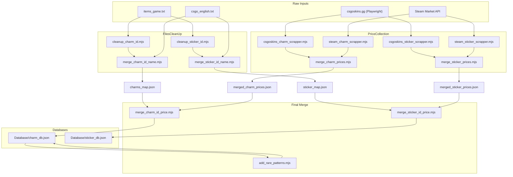

# SteamScrapper - Project Summary

## 1. Project Overview

SteamScrapper is a collection of Node.js scripts that scrape the Steam Community Market for CS2 (Counter-Strike 2) weapon skins to find good deals. The project identifies undervalued listings by analyzing:

- **Float values** -- the numeric wear value of a skin (0.0 = perfect, 1.0 = most worn).
- **Attached stickers** -- stickers applied to weapon skins that add collectible value.
- **Attached charms (keychains)** -- cosmetic charms attached to weapon skins.

All skin metadata (float, stickers, charms) is obtained by decoding the `steam://` inspect link embedded in each Steam market listing using the `@csfloat/cs2-inspect-serializer` library. The decoded object provides `paintwear` (float), `stickers[]`, and `keychains[]`.

### Runtime

- **Language:** Node.js with ESM modules (`.mjs` files)
- **No `package.json`** -- dependencies must be installed manually
- **Dependencies:**
  - `playwright` -- browser automation for Chromium-based scrappers
  - `exceljs` -- XLSX workbook output for scan results
  - `@csfloat/cs2-inspect-serializer` -- decodes Steam inspect links
  - `node-fetch` -- HTTP requests in endpoint-based scrappers

### Currency

All Steam API calls use currency code `3` (EUR). Prices from external sources in USD are converted using a hardcoded rate (`USD_TO_EUR_RATE = 0.87`).

---

## 2. Directory Structure

```
SteamScrapper/
├── docs/
│   └── project-summary.md              # This file
├── Database/                            # Final ID-keyed JSON databases consumed by scrappers
│   ├── sticker_db.json                  #   Sticker ID -> { stickerName, price, source }
│   └── charm_db.json                    #   { charms: { ID -> { charmName, price, source, rarePatterns } } }
├── GameFiles/                           # Raw Valve VDF game data files
│   ├── csgo_english.txt                 #   English localization tokens
│   └── items_game.txt                   #   Item schema (sticker_kits, keychain_definitions, etc.)
├── testDecode.mjs                       # CLI helper: node testDecode.mjs "<inspect_link>"
│
└── src/
    ├── Helpers/                          # Shared reusable modules (see Section 6)
    │   ├── Cli/
    │   │   └── parse-args.mjs           #   CLI argument parsers for all scrapper types
    │   ├── Config/
    │   │   └── constants.mjs            #   Central config: URLs, APPID, currency, defaults, wear map
    │   ├── db/
    │   │   └── load-databases.mjs       #   Loads sticker_db.json and charm_db.json into Maps
    │   ├── Output/
    │   │   └── excel-writer.mjs         #   XLSX writers for sticker and float results
    │   ├── Scanners/
    │   │   ├── float-scan-utils.mjs     #   Float-specific DOM extraction, ranking, endpoint parsing
    │   │   └── sticker-charm-scan-utils.mjs  # Sticker/charm page scanning and valuation
    │   ├── Steam/
    │   │   ├── browser-utils.mjs        #   Playwright setup, rate-limit detection, pagination
    │   │   ├── endpoint-utils.mjs       #   HTTP render endpoint helpers (no Playwright)
    │   │   ├── market-utils.mjs         #   Search API, cookie/header helpers, skin matching
    │   │   └── steam-price-collection.mjs  # Shared helpers for price collection scripts
    │   ├── Utils/
    │   │   ├── general.mjs              #   sleep, debugLog, formatEuro, formatDurationMs
    │   │   ├── price-utils.mjs          #   Price parsing and currency conversion
    │   │   └── url-utils.mjs            #   Steam URL parsing and validation
    │   ├── Valuation/
    │   │   └── value-utils.mjs          #   Sticker/charm valuation and edge/efficiency scoring
    │   └── Workers/
    │       ├── worker-utils.mjs         #   Playwright worker pool (injectable scan function)
    │       ├── float-worker-utils.mjs   #   Float multi weapon worker (XLSX-oriented results)
    │       └── endpoint-worker-utils.mjs  # HTTP worker pool for endpoint variant
    │
    ├── MarketScrappers/                  # Main scrapper entry points
    │   ├── Float/
    │   │   ├── Multi/
    │   │   │   └── multi_scrapper_extensionless.mjs     # All skins for a weapon (Playwright)
    │   │   └── Single/
    │   │       ├── single_scrapper_extensionless.mjs    # One listing URL (Playwright)
    │   │       └── single_scrapper_endpoint.mjs         # One listing URL (HTTP, no browser)
    │   └── Sticker/
    │       └── Multi/
    │           ├── sticker_charm_scraper_playwright.mjs  # All skins for a weapon (modular)
    │           └── market_sticker_scrapper_browser.mjs   # Legacy monolith (~1839 lines)
    │
    ├── PriceCollection/                  # Scripts that scrape sticker/charm prices
    │   ├── Scrape_Sticker_prices/
    │   │   ├── steam_sticker_scrapper.mjs       # Scrape sticker prices from Steam market
    │   │   ├── csgoskins_sticker_scrapper.mjs   # Scrape sticker prices from csgoskins.gg
    │   │   └── merge_sticker_prices.mjs         # Merge Steam + csgoskins into one file
    │   └── Scrape_Charm_prices/
    │       ├── steam_charm_scrapper.mjs          # Scrape charm prices from Steam market
    │       ├── csgoskins_charm_scrapper.mjs      # Scrape charm prices from csgoskins.gg
    │       └── merge_charm_prices.mjs            # Merge Steam + csgoskins into one file
    │
    ├── FilesCleanUp/                     # Pipeline: game files -> name/ID maps -> final DBs
    │   ├── Charms/
    │   │   ├── cleanup_charm_id.mjs             # Extract keychain_definitions from items_game.txt
    │   │   ├── merge_charm_id_name.mjs          # Map charm display names to numeric IDs
    │   │   ├── merge_charm_id_price.mjs         # Join name map + prices -> charm_db.json
    │   │   └── add_rare_patterns.mjs            # Add rare paint-seed ranges to charm_db.json
    │   └── Stickers/
    │       ├── cleanup_sticker_id.mjs           # Extract sticker_kits from items_game.txt
    │       ├── merge_sticker_id_name.mjs        # Map sticker display names to numeric IDs
    │       └── merge_sticker_id_price.mjs       # Join name map + prices -> sticker_db.json
    │
    └── PricesAndMaps/                    # Intermediate JSON data files
        ├── Charms/Data/
        │   ├── charms_map.json                  # Charm name -> { stickerid }
        │   ├── steam_charm_prices.json          # Prices from Steam
        │   ├── csgoskins_charm_prices.json      # Prices from csgoskins.gg
        │   └── merged_charm_prices.json         # Combined prices
        └── Stickers/
            ├── sticker_map.json                 # Sticker name -> { stickerid }
            ├── steam_sticker_prices.json        # Prices from Steam
            ├── csgoskins_sticker_prices.json    # Prices from csgoskins.gg
            └── merged_sticker_prices.json       # Combined prices
```

---

## 3. Three Scrapper Types

### 3.1 Float Scrapper

**Location:** `src/MarketScrappers/Float/`

Finds weapon skins with the lowest or highest float values. Useful for collectors seeking near-perfect or maximally worn skins.

- **Multi scrapper** -- Searches Steam market for ALL skins of a given weapon + wear category, then scans each skin's listings for float values. Outputs an XLSX workbook with one sheet per skin.
- **Single scrapper** -- Scans one specific listing URL for the best floats across all its listings.

**How it works:**
1. Each listing's `steam://` inspect link is decoded to extract `paintwear` (the float value).
2. Listings are ranked by float (lowest or highest, depending on `--mode`).
3. Results show the top N floats with their prices.

### 3.2 Sticker/Charm Scrapper

**Location:** `src/MarketScrappers/Sticker/`

Finds weapon skins where attached stickers and/or charms provide value that exceeds the price premium over the base skin price. Uses the `?filter=sticker` URL parameter to focus on listings that have attachments.

- **Multi scrapper** -- Searches all skins for a given weapon, scans filtered listing pages, values all attachments against the sticker/charm price database, and ranks by edge or efficiency.

**How it works:**
1. Each listing's inspect link is decoded to get `stickers[]` and `keychains[]`.
2. Each sticker/charm ID is looked up in `Database/sticker_db.json` or `Database/charm_db.json` to get its market price.
3. Sticker value is weighted at 10% (`UNIVERSAL_STICKER_WEIGHT = 0.1`), charm value at 100%.
4. Edge and efficiency scores are computed (see Section 11).
5. Results are sorted by edge or efficiency and exported to XLSX.

### 3.3 Charm Scrapper (Not Yet Implemented)

A dedicated charm-only scrapper for finding skins with valuable charms. Not yet built, but the shared helper infrastructure supports it.

---

## 4. Two Scrapper Variants

Every scrapper can be implemented in one of two transport variants:

### 4.1 Playwright (Browser) Variant

- Launches Chromium via the `playwright` library.
- Navigates to Steam market listing pages in a real browser.
- Forces page size to 100 by evaluating `g_oSearchResults.m_cPageSize = 100`.
- Paginates using `g_oSearchResults.GoToPage(pageIndex, true)`.
- Reads inspect links from the DOM: `.market_listing_row_action a[href^="steam://"]`.
- Reads prices from DOM text elements.
- Can use `--cookie` for authenticated sessions and `--headful`/`--headless` for visibility.
- **File naming convention:** `*_extensionless.mjs`, `*_browser.mjs`, `*_playwright.mjs`.

### 4.2 Endpoint (Direct HTTP) Variant

- Uses `node-fetch` (or global `fetch`) to call Steam's listing render endpoint directly:
  `https://steamcommunity.com/market/listings/730/{name}/render?currency=X&start=Y&count=Z`
- Parses `results_html` from the JSON response using regex to extract inspect links.
- Gets structured price data from the `listinginfo` JSON object.
- No browser overhead, faster execution.
- **File naming convention:** `*_endpoint.mjs`.

---

## 5. Scrapper Existence Matrix

| Scrapper Type | Multi (Playwright) | Multi (Endpoint) | Single (Playwright) | Single (Endpoint) |
|---|---|---|---|---|
| **Float** | Yes | -- | Yes | Yes |
| **Sticker/Charm** | Yes (monolith + modular) | -- | -- | -- |
| **Charm-only** | -- | -- | -- | -- |

**Legend:** "Yes" = implemented, "--" = not yet implemented.

---

## 6. Shared Helpers (`src/Helpers/`)

All helpers are ES modules that export functions. They are designed to be scrapper-agnostic and reusable.

### 6.1 `Cli/parse-args.mjs`

Exports multiple CLI parsers for different scrapper types:

| Export | Used by | Purpose |
|---|---|---|
| `parseWeaponSearchArgs(argv)` | Sticker/Charm Multi | `--weapon`, `--condition`, `--quality`, `--maxprice`, `--edge`/`--efficiency` |
| `parseFloatMultiArgs(argv)` | Float Multi | `--weapon`, `--wear` (fn/bs), `--mode`, `--quality` (incl. sv), `--language`, `--max-skins`, `--max-listings-per-skin` |
| `parseSingleUrlArgs(argv)` | Float Single (both variants) | `--url`, `--mode`, `--max-windows`, `--currency` |
| `validateCommonArgs(args)` | All parsers | Validates `--top`, `--workers`, `--wait-ms` |
| `parseArgs(argv)` | Deprecated alias | Calls `parseWeaponSearchArgs` |

### 6.2 `Config/constants.mjs`

Central configuration. Key exports:

| Constant | Value | Purpose |
|---|---|---|
| `APPID` | `730` | CS2 Steam App ID |
| `CURRENCY` | `3` | Steam currency code (EUR) |
| `USD_TO_EUR_RATE` | `0.87` | Conversion rate for csgoskins USD prices |
| `SEARCH_PAGE_SIZE` | `100` | Items per page in search API |
| `TARGET_PAGE_SIZE` | `100` | Items per page in listing browser view |
| `SKIP_LISTING_THRESHOLD` | `1000` | Skip skins with more filtered listings than this |
| `UNIVERSAL_STICKER_WEIGHT` | `0.1` | Stickers valued at 10% of their market price |
| `USER_AGENT` | Chrome 146 UA | Shared across all HTTP requests |
| `WEAR_MAP` | fn/mw/ft/ww/bs | Maps wear keys to display names, suffixes, and search tags |
| `STICKER_QUALITY_VALUES` | normal, st, both | Valid quality values for sticker scrappers |
| `FLOAT_WEAPON_QUALITY_VALUES` | normal, st, sv | Valid quality values for float scrappers (includes Souvenir) |
| `STICKER_DB_PATH` / `CHARM_DB_PATH` | Resolved paths | Paths to `Database/*.json` |
| `DEFAULT_TOP`, `DEFAULT_OUT`, `DEFAULT_WAIT_MS`, `DEFAULT_WORKERS` | 25, xlsx name, 1200, 3 | Sticker scrapper defaults |
| `DEFAULT_FLOAT_TOP`, `DEFAULT_FLOAT_OUT`, `DEFAULT_FLOAT_WAIT_MS`, `DEFAULT_MAX_WINDOWS` | 10, xlsx name, 1500, 10 | Float scrapper defaults |

### 6.3 `db/load-databases.mjs`

- `loadStickerDb()` -- Reads `sticker_db.json`, returns `{ stickerMap: Map<string, { id, stickerName, price, source }> }`.
- `loadCharmDb()` -- Reads `charm_db.json`, returns `{ charmMap: Map, highlightReelMap: Map }`. Charms from `data.charms`, highlight reels from `data.highlight_reels`.

### 6.4 `Output/excel-writer.mjs`

- `sortListings(listings, sortBy)` -- Sorts by edge or efficiency with tie-breaking.
- `writeStickerWorkbook({...})` -- Multi-sheet XLSX: Results, Processed Skins, Skipped, Failed, Missing IDs, Summary.
- `writeFloatWorkbook({...})` -- Per-skin sheets with Skin/Price/Float columns.
- `safeSheetName(name, usedNames)` -- Sanitizes Excel sheet names (max 31 chars, no special chars).

### 6.5 `Scanners/sticker-charm-scan-utils.mjs`

- `extractListingsFromCurrentPage(...)` -- Reads DOM rows, decodes inspect links, values stickers/charms, computes scores. Skips rows without attachments.
- `scanSkinPage(...)` -- Full skin scan: navigate to `{url}?filter=sticker`, paginate, threshold check, collect valued listings.

### 6.6 `Scanners/float-scan-utils.mjs`

- `rankFloatListings(listings, mode, top)` -- Sort by float (lowest/highest), tie-break by price.
- `extractFloatListingsFromCurrentPage(...)` -- DOM extraction for float multi: inspect link -> decode -> `paintwear`.
- `floatScanSkinPage(...)` -- Full skin float scan: navigate, paginate, rank results.
- `extractFloatListingsFromRenderPayload(...)` -- Endpoint variant: parse `listinginfo` + `results_html` -> float listings.
- `buildListingBrowserWorkerPlan(...)` -- Split listing indices across browser workers for single-URL scans.
- `goToResultPageWithRetry(...)` -- Page navigation with retry logic.
- `extractFloatListingsFromCurrentPageInRange(...)` -- Single-URL variant: filter rows by global listing index range.

### 6.7 `Steam/browser-utils.mjs`

Playwright helpers with rate-limit detection:

- `setupBrowserContext(args)` -- Launches Chromium, sets user agent, applies cookies.
- `waitForListingPageStable(page, args)` -- Waits for DOMContentLoaded + rate-limit checks.
- `forcePageSize(page, args, size)` -- Sets `g_oSearchResults.m_cPageSize` and reloads page 0.
- `goToResultPage(page, args, pageIndex)` -- Navigates to a specific page via `GoToPage()`.
- `getSearchResultsMeta(page)` -- Reads `pageSize`, `totalCount`, `currentPage` from `g_oSearchResults`.
- `isRateLimitText(text)` / `isRateLimitError(error)` -- Detects 429/rate-limit responses.
- `assertPageNotRateLimited(page)` -- Throws on rate limit.

### 6.8 `Steam/endpoint-utils.mjs`

HTTP render endpoint helpers (zero Playwright dependency):

- `buildRenderUrl(marketHashName, start, count, currency)` -- Constructs render API URL.
- `buildRenderHeaders(refererUrl, cookie)` -- Headers with UA, Accept, Referer, optional Cookie.
- `fetchRenderPageJson(url, headers)` -- Fetch and parse JSON from render endpoint.
- `extractInspectLinksFromResultsHtml(resultsHtml)` -- Regex extraction of `listing_<id>` -> `steam://` links.
- `decodeHtmlEntities(text)` -- Converts `&amp;`, `&quot;`, etc.
- `extractPriceTextFromListingInfo(listing, currencyId)` -- Human-readable price from `listinginfo` entry.
- `currencyCodeFromSteamCurrencyId(id)` / `formatSteamMoney(cents, currencyId)` -- Currency formatting.

### 6.9 `Steam/market-utils.mjs`

Steam market search API and skin matching:

- `parseCookieHeader(rawCookie)` -- Cookie string -> Playwright cookie objects.
- `buildSearchHeaders(cookie)` -- Headers for market search requests.
- `fetchJson(url, params, headers)` -- Generic fetch with URL param building.
- `buildListingPageUrl(marketHashName)` -- Listing page URL for APPID 730.
- `extractSkinNameParts(marketHashName)` -- Splits `"Weapon | Skin (Wear)"` into parts.
- `isMatchingQuality(marketHashName, quality)` -- Filter by normal/st/both (excludes Souvenir).
- `isMatchingWeaponSkin(result, weapon, conditionSet, quality)` -- Full filter for multi-condition search.
- `isWeaponSkinFloatSearchMatch(result, weapon, wearConfig, quality)` -- Float-specific filter (single wear, supports sv).
- `fetchAllSkinSearchResults(args, headers, options)` -- Paginated search with optional `mapResult` callback.
- `fetchFloatWeaponSkinSearchResults(args, headers)` -- Float multi: single wear tag, language param, maxSkins cap.
- `getBasePriceCentsFromSearchResult(result)` -- Extract base price from search result.

### 6.10 `Steam/steam-price-collection.mjs`

Shared helpers for price-collection scripts (sticker/charm DB scrapers):

- `buildStickerToolSearchUrl(start)` / `buildCharmSearchUrl(start)` -- Pre-built search URLs with category filters.
- `buildPriceHistoryUrl(name)` -- Steam price history endpoint URL.
- `buildStickerToolSearchHeaders()` / `buildCharmSearchHeaders()` -- Request headers.
- `fetchSteamJsonFromText(url, headers)` -- Fetch -> text -> JSON.parse (legacy behavior).
- `createStickerPriceCollectionFetch({...})` -- Factory that returns `{ fetchJson, printStats }` with request counting and optional long sleep after N requests.

### 6.11 `Utils/general.mjs`

- `sleep(ms)` -- Promise-based delay.
- `debugLog(args, ...parts)` -- Logs only when `args.debug` is true.
- `formatEuro(value)` -- Fixed 2-decimal display.
- `formatEfficiencyDisplay(value)` -- "INF" for Infinity, else 4 decimals.
- `sortedNumericStrings(values)` -- Sort string IDs as numbers.
- `formatDurationMs(ms)` -- Human-readable "Xh Ym Zs".

### 6.12 `Utils/price-utils.mjs`

- `eurosFromUsdCents(cents)` -- `(cents / 100) * USD_TO_EUR_RATE`.
- `centsFromPossibleSteamValue(value)` -- Integer check for Steam cent values.
- `extractCentsFromPriceText(priceText)` -- Parse locale-mixed price string -> cents.
- `normalizeNumberPrice(value)` -- Finite number or 0.
- `extractCentsFromListingInfo(listing)` -- Sum `converted_price + converted_fee` from render API `listinginfo`.
- `parseSteamLocalePriceDisplay(str)` -- Parse localized price strings (returns null on failure, for price collection scripts).

### 6.13 `Utils/url-utils.mjs`

- `extractMarketHashNameFromUrl(url)` -- Decode market hash name from a listing URL path.
- `validateSteamListingUrl(url)` -- Validate host is `steamcommunity.com` with correct path.

### 6.14 `Valuation/value-utils.mjs`

- `valueStickers(decoded, stickerMap, missingTracker, args)` -- Sum DB prices for `decoded.stickers[]`. Returns `{ stickersRawValue, stickerNames, stickerIds }`.
- `valueKeychains(decoded, stickerMap, charmMap, highlightReelMap, missingTracker, args)` -- Handle keychain types: ID 37 = Sticker Slab, 36/83 = Highlight Reels, others = normal charms. Checks rare patterns.
- `computeScores(basePriceEuro, listingPriceEuro, stickersRawValue, charmsValue)` -- Returns `{ premiumPaid, attachedValue, edge, efficiency }`.
- `hasRarePattern(ranges, pattern)` -- Binary search on sorted `{start, end}` ranges.

### 6.15 `Workers/worker-utils.mjs`

- `splitItemsForWorkers(items, workerCount)` -- Round-robin distribution with `originalIndex`, `displayIndex`, `totalCount`.
- `createMissingTracker()` -- Creates `{ stickers: Set, charms: Set, highlightReels: Set }`.
- `addRemainingSkinsAsFailed(assignedSkins, startIndex, reason, failedSkins)` -- Mark remaining queue as failed after abort.
- `workerRun(workerIndex, assignedSkins, args, scanFn)` -- Playwright worker loop with injectable `scanFn(page, skin, args, workerLabel)`. Handles rate-limit abort, page recovery, and error tracking.

### 6.16 `Workers/float-worker-utils.mjs`

- `floatWeaponWorkerRun(workerIndex, assignedSkins, args, scanSkinPage)` -- Float multi variant: one browser per worker, iterates skins, tracks results with `originalIndex` for correct ordering. Returns `{ results, skippedSkins }`.

### 6.17 `Workers/endpoint-worker-utils.mjs`

- `buildHttpWorkerPlan(totalListings, pageSize, maxWorkers)` -- Split HTTP requests across workers by offset ranges.
- `httpWorkerRun(plan, args, requestSpacingMs, pageSize, onPageStart)` -- Sequential fetch loop with stagger delay and cooldown.

---

## 7. Data Pipeline (Game Files to Databases)

The pipeline transforms raw game files and scraped prices into ID-keyed JSON databases used by the market scrappers.



### Pipeline Execution Order

1. Extract `items_game.txt` and `csgo_english.txt` from CS2 game files.
2. **Charms:** `cleanup_charm_id.mjs` -> `merge_charm_id_name.mjs` -> produces `charms_map.json`.
3. **Stickers:** `cleanup_sticker_id.mjs` -> `merge_sticker_id_name.mjs` -> produces `sticker_map.json`.
4. **Prices:** Run csgoskins + Steam scrapers for both charms and stickers, then run `merge_charm_prices.mjs` / `merge_sticker_prices.mjs`.
5. **Final DBs:** `merge_charm_id_price.mjs` -> `charm_db.json`; `merge_sticker_id_price.mjs` -> `sticker_db.json`.
6. **Optional:** `add_rare_patterns.mjs` updates `charm_db.json` with rare paint-seed ranges.

---

## 8. Price Collection Scripts (`src/PriceCollection/`)

### Sticker Prices

| Script | Source | Method | Output |
|---|---|---|---|
| `steam_sticker_scrapper.mjs` | Steam market search API | JSON search (`tag_CSGO_Tool_Sticker`). For items with >8 listings uses search price; for rare stickers fetches `/pricehistory` and averages last 3 entries. Requires `STEAM_COOKIE` for history. | `steam_sticker_prices.json` |
| `csgoskins_sticker_scrapper.mjs` | csgoskins.gg | Playwright browser pagination over sticker pages. Extracts title + USD price, converts to EUR (rate 0.92). | `csgoskins_sticker_prices.json` |
| `merge_sticker_prices.mjs` | Both price files | csgoskins first; Steam adds missing or averages with existing. `source`: "csgoskins", "steam", or "average". | `merged_sticker_prices.json` |

**Usage:**
```
node steam_sticker_scrapper.mjs [pageNumber] [--sleep]
node csgoskins_sticker_scrapper.mjs <startingPage> [--headful]
node merge_sticker_prices.mjs
```

### Charm Prices

| Script | Source | Method | Output |
|---|---|---|---|
| `steam_charm_scrapper.mjs` | Steam market search API | JSON search with keychain capsule filters. `sell_price` in cents -> euros. | `steam_charm_prices.json` |
| `csgoskins_charm_scrapper.mjs` | csgoskins.gg | Playwright pagination over charm pages. USD -> EUR (rate 0.92). Preserves `rarePatterns` from existing DB. | `csgoskins_charm_prices.json` |
| `merge_charm_prices.mjs` | Both price files | Same merge strategy as stickers. Also carries `rarePatterns` for `Charm |` entries. | `merged_charm_prices.json` |

**Usage:**
```
node steam_charm_scrapper.mjs [pageNumber]
node csgoskins_charm_scrapper.mjs <startingPage> [--headful]
node merge_charm_prices.mjs
```

---

## 9. Files Cleanup Scripts (`src/FilesCleanUp/`)

### Charms

| Script | Input | Output | Purpose |
|---|---|---|---|
| `cleanup_charm_id.mjs` | `items_game.txt` | `merged_charms.txt` | Extracts `keychain_definitions` and `highlight_reels` blocks, deduplicates by ID. |
| `merge_charm_id_name.mjs` | `merged_charms.txt` + `csgo_english.txt` | `charms_map.json` | Resolves localization tokens to build `"Charm \| Name"` -> `{ stickerid }` map. |
| `merge_charm_id_price.mjs` | `charms_map.json` + `merged_charm_prices.json` | `charm_db.json` | Joins name map with prices, produces ID-keyed database. |
| `add_rare_patterns.mjs` | `charm_db.json` (in-place) | `charm_db.json` | CLI tool to add rare paint-seed `{start, end}` ranges to specific charms. |

### Stickers

| Script | Input | Output | Purpose |
|---|---|---|---|
| `cleanup_sticker_id.mjs` | `items_game.txt` | `merged_sticker_kits.txt` | Extracts `sticker_kits`, drops graffiti/sprays/patches, deduplicates by ID. |
| `merge_sticker_id_name.mjs` | `merged_sticker_kits.txt` + `csgo_english.txt` | `sticker_map.json` | Resolves localization tokens to build `"Sticker \| Name"` -> `{ stickerid }` map. |
| `merge_sticker_id_price.mjs` | `sticker_map.json` + `merged_sticker_prices.json` | `sticker_db.json` | Joins name map with prices, produces ID-keyed database. |

---

## 10. Data Formats

### `Database/sticker_db.json`

```json
{
  "13": { "stickerName": "Sticker | Lucky 13", "price": 0.45, "source": "average" },
  "14": { "stickerName": "Sticker | Crown (Foil)", "price": 1250.00, "source": "csgoskins" }
}
```

Root object. Keys are stringified sticker IDs. Values: `{ stickerName, price, source }`.

### `Database/charm_db.json`

```json
{
  "charms": {
    "1": {
      "charmName": "Charm | Lil' Ava",
      "price": 2.50,
      "source": "steam",
      "rarePatterns": [{ "start": 0, "end": 10 }, { "start": 500, "end": 512 }]
    }
  },
  "highlight_reels": {
    "100": { "charmName": "Souvenir Charm | ...", "price": 5.00, "source": "average" }
  }
}
```

Root has `charms` and `highlight_reels` objects. Keys are stringified IDs. Charm values include `rarePatterns` (sorted `{start, end}` inclusive ranges).

### Name Map Files (`sticker_map.json`, `charms_map.json`)

```json
{ "Sticker | Lucky 13": { "stickerid": 13 } }
```

Name-keyed. Maps display names to numeric IDs. `charms_map.json` nests under `{ "charms": { ... } }`.

### Merged Price Files

```json
{ "Sticker | Lucky 13": { "price": 0.45, "source": "average" } }
```

Name-keyed. `source` is one of `"csgoskins"`, `"steam"`, or `"average"`. Charm entries may include `rarePatterns: []`.

---

## 11. Valuation Logic (Sticker/Charm Scrapper)

### Constants

- `UNIVERSAL_STICKER_WEIGHT = 0.1` -- Stickers are valued at 10% of their database price.
- `USD_TO_EUR_RATE = 0.87` -- Used when converting csgoskins USD prices to EUR.

### Formulas (from `value-utils.mjs` / `computeScores`)

```
premiumPaid   = listingPriceEuro - basePriceEuro
attachedValue = (stickersRawValue * 0.1) + charmsValue
edge          = attachedValue - premiumPaid
efficiency    = attachedValue / premiumPaid    (Infinity if premiumPaid <= 0 and attachedValue > 0)
```

- **Edge** -- Absolute profit potential in EUR. Higher = more undervalued.
- **Efficiency** -- Ratio of attached value to premium paid. Higher = better deal per euro spent.

### Keychain Special Cases

| Keychain `stickerId` | Type | Price Source |
|---|---|---|
| `37` | Sticker Slab | Uses `wrappedSticker` ID, priced from **sticker** DB |
| `36`, `83` | Souvenir Highlight Reel | Uses `highlightReel` ID, priced from **highlight reel** map |
| Any other | Normal Charm | Priced from **charm** DB; also checks `rarePatterns` |

---

## 12. Key Constants Reference

| Constant | Value | File |
|---|---|---|
| `APPID` | `730` | `constants.mjs` |
| `CURRENCY` | `3` (EUR) | `constants.mjs` |
| `USD_TO_EUR_RATE` | `0.87` | `constants.mjs` |
| `SEARCH_PAGE_SIZE` | `100` | `constants.mjs` |
| `TARGET_PAGE_SIZE` | `100` | `constants.mjs` |
| `SKIP_LISTING_THRESHOLD` | `1000` | `constants.mjs` |
| `UNIVERSAL_STICKER_WEIGHT` | `0.1` | `constants.mjs` |
| `USER_AGENT` | Chrome 146 | `constants.mjs` |
| `DEFAULT_TOP` (sticker) | `25` | `constants.mjs` |
| `DEFAULT_WAIT_MS` (sticker) | `1200` | `constants.mjs` |
| `DEFAULT_WORKERS` | `3` | `constants.mjs` |
| `DEFAULT_FLOAT_TOP` | `10` | `constants.mjs` |
| `DEFAULT_FLOAT_WAIT_MS` | `1500` | `constants.mjs` |
| `DEFAULT_MAX_WINDOWS` | `10` | `constants.mjs` |
| `DEFAULT_LANGUAGE` | `"english"` | `constants.mjs` |

---

## 13. CLI Reference

### Sticker/Charm Multi: `parseWeaponSearchArgs`

```
node sticker_charm_scraper_playwright.mjs --weapon "AK-47" [options]
```

| Flag | Required | Default | Description |
|---|---|---|---|
| `--weapon` | Yes | -- | Weapon name (e.g. "AK-47", "AWP") |
| `--condition` | No | all (fn mw ft ww bs) | One or more wear values |
| `--quality` | No | `normal` | `normal`, `st`, or `both` |
| `--maxprice` | No | -- | Max EUR base price filter |
| `--top` | No | `25` | How many top results to export |
| `--out` | No | `steam_sticker_charm_scan_results.xlsx` | Output file path |
| `--workers` | No | `3` | Parallel browser workers |
| `--edge` | No | -- | Sort results by edge |
| `--efficiency` | No | (default) | Sort results by efficiency |
| `--wait-ms` | No | `1200` | Delay between page actions (ms) |
| `--cookie` | No | -- | Raw Steam cookie header |
| `--headful` | No | (default) | Show browser windows |
| `--headless` | No | -- | Hide browser windows |
| `--debug` | No | -- | Enable verbose logging |

### Float Multi: `parseFloatMultiArgs`

```
node multi_scrapper_extensionless.mjs --weapon "AWP" --wear fn --mode lowest [options]
```

| Flag | Required | Default | Description |
|---|---|---|---|
| `--weapon` | Yes | -- | Weapon name |
| `--wear` | Yes | -- | `fn` or `bs` only |
| `--mode` | Yes | -- | `lowest` or `highest` |
| `--quality` | No | `normal` | `normal`, `st`, or `sv` (Souvenir) |
| `--top` | No | `10` | Top floats to keep per skin |
| `--out` | No | `steam_weapon_float_scan_results.xlsx` | Output file |
| `--language` | No | `english` | Steam search language |
| `--workers` | No | `3` | Parallel browser workers |
| `--max-skins` | No | -- | Limit how many skins to scan |
| `--max-listings-per-skin` | No | -- | Stop after N decoded listings per skin |
| `--wait-ms` | No | `1500` | Delay between page actions (ms) |
| `--cookie` | No | -- | Raw Steam cookie header |
| `--headful` | No | (default) | Show browser windows |
| `--headless` | No | -- | Hide browser windows |
| `--debug` | No | -- | Enable verbose logging |

### Float Single: `parseSingleUrlArgs`

```
node single_scrapper_extensionless.mjs --url "https://steamcommunity.com/market/listings/730/..." [options]
node single_scrapper_endpoint.mjs --url "https://steamcommunity.com/market/listings/730/..." [options]
```

| Flag | Required | Default | Description |
|---|---|---|---|
| `--url` | Yes | -- | Steam market listing URL |
| `--mode` | No | `lowest` | `lowest` or `highest` |
| `--top` | No | `10` | How many best results to print |
| `--max-windows` | No | `10` | Worker count (browsers or HTTP workers) |
| `--wait-ms` | No | `1500` | Cooldown between operations (ms) |
| `--currency` | No | `3` (EUR) | Steam currency ID |
| `--cookie` | No | -- | Raw Steam cookie header |
| `--headful` | No | -- | Show browser windows (Playwright only) |
| `--headless` | No | (default) | Hide browser windows |
| `--debug` | No | -- | Enable verbose logging |

---

## 14. Legacy / Notes

- **`market_sticker_scrapper_browser.mjs`** (~1839 lines) is a monolithic version of the sticker/charm scrapper. The modular entry point `sticker_charm_scraper_playwright.mjs` (~161 lines) replaces it using shared helpers. The monolith is kept for reference but is not maintained.
- **`testDecode.mjs`** is a small CLI utility: `node testDecode.mjs "<steam_inspect_link>"` prints the decoded inspect payload.
- **`csgo_english.txt`** at the project root is a duplicate of `GameFiles/csgo_english.txt`.
- There is **no `package.json`** -- dependencies must be installed globally or via a manually created package file.
